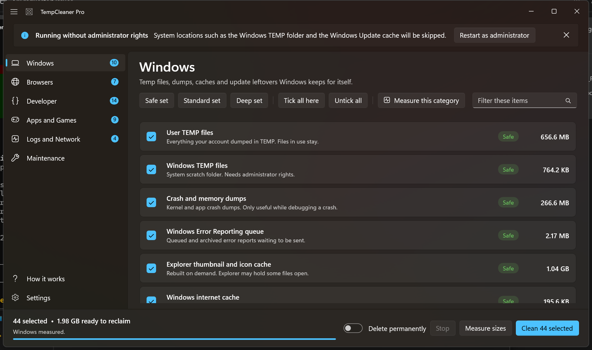
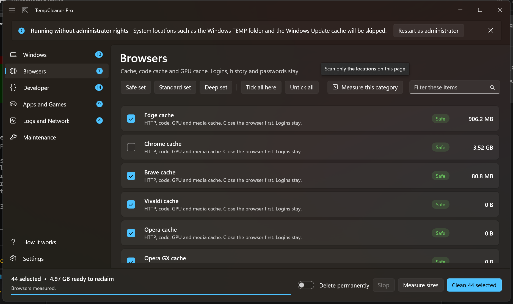
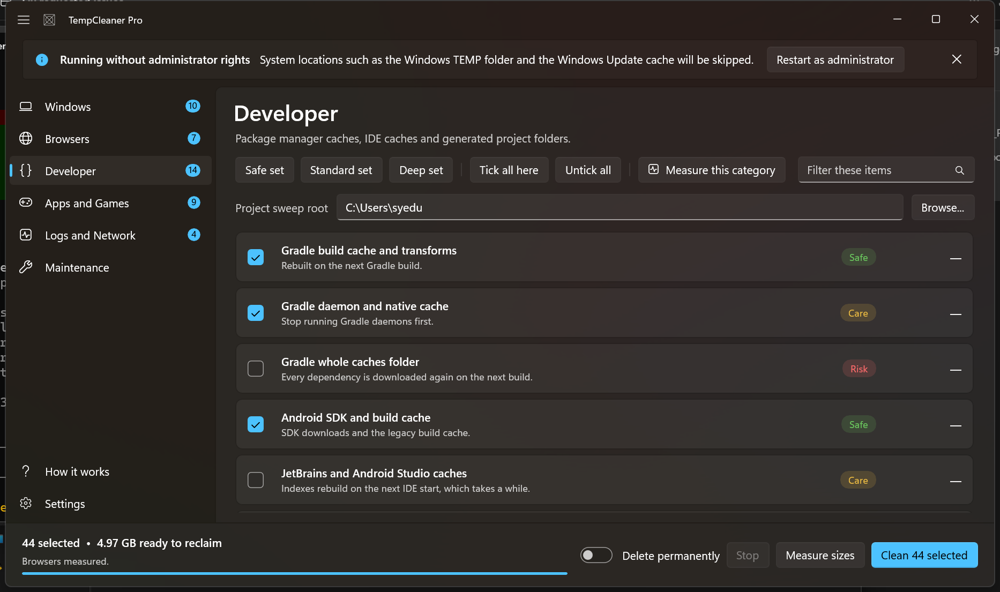
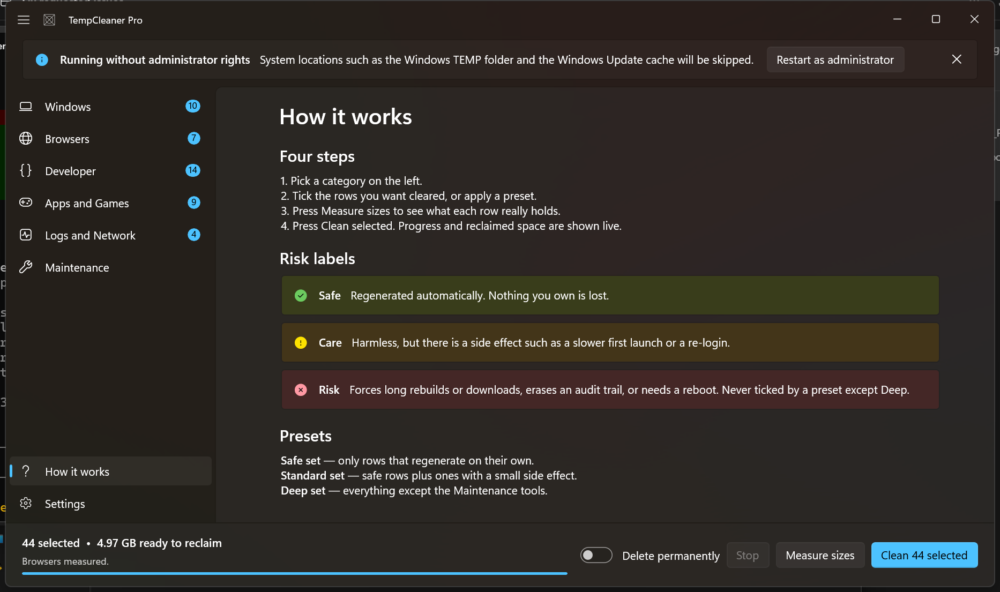
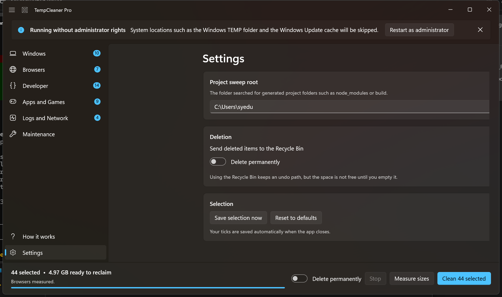
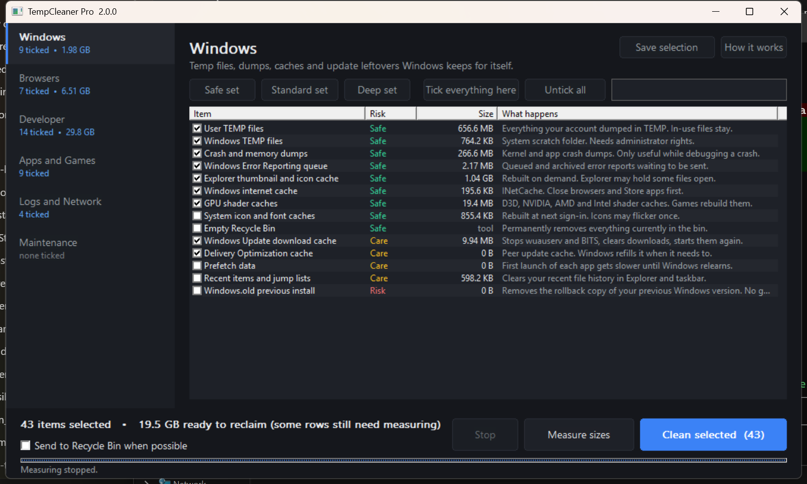
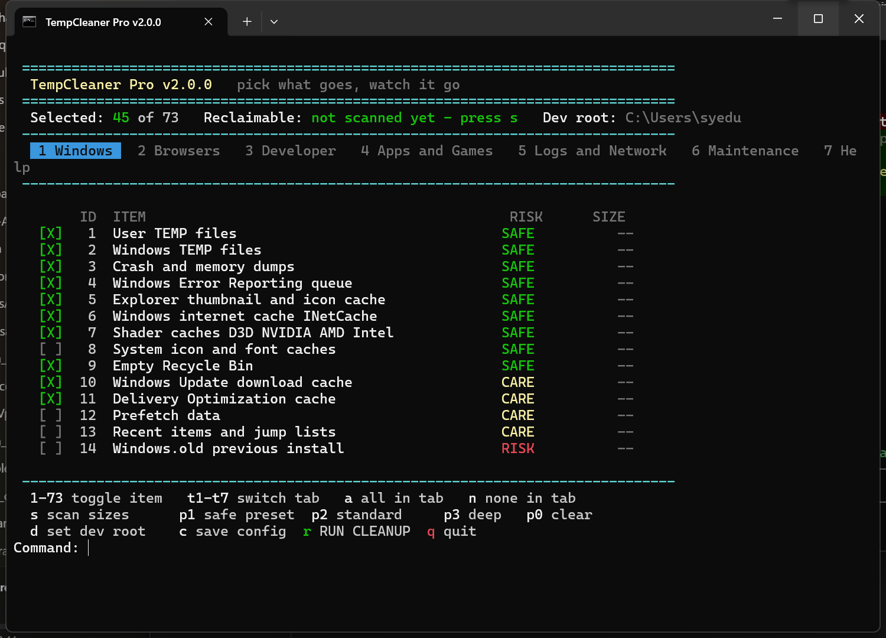

<div align="center">

# WinSweep

### Pick what goes. Watch it go.

A Windows cleaner that shows you the size of every cache **before** it touches anything,
explains in plain English what each row actually does, and never scans or deletes without a click.

**Three builds, one catalogue:** a Fluent WinUI 3 app, a 230 KB single-file Win32 app,
and a console version that runs anywhere.

Developer: **infusiblecoder**

</div>

---



## Why another cleaner

Most cleaners hand you a checkbox called "Temporary files" and a progress bar you have to trust.
WinSweep does the opposite:

- **Sizes first.** Every row is measured before you commit, so `1.98 GB ready to reclaim`
  is a fact, not a guess. It measures again afterwards and reports the real reclaimed total.
- **Plain English consequences.** Each row says what happens next — *"Indexes rebuild on the
  next IDE start, which takes a while"*, not *"Optimizes IDE storage"*.
- **Three honest risk levels.** Safe, Care and Risk, colour coded, with Risk never ticked by a
  preset other than Deep and always named in the confirmation dialog.
- **Nothing happens on launch.** No background scan, no telemetry, no network. The disk stays
  quiet until you press *Measure sizes*.
- **Project sweeps that read markers.** `build` is only deleted next to a `build.gradle` or
  `CMakeLists.txt`; `target` only next to a `Cargo.toml`. Your holiday photos in a folder
  called `build` are safe.

## What it cleans

~75 targets across six categories.

| Category | Examples |
|---|---|
| **Windows** | User and system TEMP, crash and memory dumps, WER queue, thumbnail and icon cache, INetCache, D3D/NVIDIA/AMD/Intel shader caches, Windows Update download cache, Delivery Optimization, Prefetch, Windows.old |
| **Browsers** | Edge, Chrome, Brave, Vivaldi, Opera, Opera GX and Firefox — HTTP cache, code cache, GPU cache, media cache, service worker storage. Logins, history and passwords are never touched |
| **Developer** | Gradle, Maven, npm, Yarn, pnpm, pip, NuGet, Cargo, Go, Pub, Android SDK, JetBrains, VS Code, Visual Studio, Unity, Unreal, Docker build cache, plus project sweeps for `node_modules`, `build`, `bin`, `obj`, `target`, `.gradle`, `.dart_tool`, `__pycache__`, `.pytest_cache`, `.mypy_cache`, `.ruff_cache` |
| **Apps and Games** | Discord, Spotify, Teams, Slack, Zoom, Steam shader cache, Epic, Battle.net, EA, Adobe media cache, Office cache, Telegram, WhatsApp |
| **Logs and Network** | CBS and setup logs, Defender logs, DISM logs, WinINet logs, DNS flush, ARP flush, IP release/renew, Winsock reset, event logs |
| **Maintenance** | System restore point, Disk Cleanup preset 50, DISM component cleanup, TRIM, Explorer restart |

## Screenshots

### WinUI 3 app

| Windows | Browsers |
|---|---|
|  |  |

| Developer, with project sweep root | How it works |
|---|---|
|  |  |

<div align="center">



</div>

### Win32 app — one file, 230 KB, no runtime



### Console version — tabs and progress bars in plain cmd



## Install

### Option 1 — WinUI 3 app (recommended)

Requires Windows 10 1809 or newer. Nothing else: the build is self contained, so no .NET
runtime, no Windows App SDK runtime, no MSIX and no Developer Mode.

```bat
git clone https://github.com/syedusama5556/WinSweep.git
cd WinSweep
build\build-winui.bat
```

Then run:

```
src\winui\bin\Release\net9.0-windows10.0.26100.0\win-x64\TempCleanerWinUI.exe
```

Ship or copy the whole `win-x64` folder — it runs from a USB stick.

**Build requirements:** [.NET SDK 9](https://dotnet.microsoft.com/download) and a C++
compiler for the native scanner.

```bat
winget install Microsoft.DotNet.SDK.9
winget install BrechtSanders.WinLibs.POSIX.UCRT   :: or use MSVC Build Tools
```

### Option 2 — Win32 app, single file

No runtime, no installer, 230 KB.

```bat
build\build-win32-mingw.bat   :: MinGW-w64
build\build-win32-msvc.bat    :: from a Developer Command Prompt
```

Output: `dist\TempCleanerPro.exe`.

### Option 3 — Console version

No build step. Double-click it, or:

```bat
src\batch\TempCleaner.bat
```

It re-launches itself elevated, then gives you the same catalogue with tabs, tick boxes,
size scanning and progress bars in a plain console.

### Administrator rights

All three builds ask for elevation. Without it they still work, but system locations such as
`C:\Windows\Temp` and the Windows Update cache are skipped — the WinUI app says so in a banner
with a **Restart as administrator** button.

## Using it

1. **Pick a category** in the left pane. The badge shows how many rows are ticked.
2. **Tick rows**, or apply a preset:
   - **Safe set** — only rows that regenerate on their own.
   - **Standard set** — safe rows plus ones with a small side effect.
   - **Deep set** — everything except the Maintenance tools.
3. **Measure sizes** — globally, or *Measure this category* for just the page you are on.
4. **Clean selected.** The dialog lists every Risk row and states whether items go to the
   Recycle Bin or are deleted permanently. Progress and the item being processed are live;
   a summary lists what each row actually freed.

Ticks are saved to `%APPDATA%\TempCleanerPro\` and restored next time.

### Risk levels

| Level | Meaning |
|---|---|
| 🟢 **Safe** | Regenerated automatically. Nothing you own is lost. |
| 🟡 **Care** | Harmless, but there is a side effect: a slower first launch, a re-login, a re-sync. |
| 🔴 **Risk** | Forces long rebuilds or downloads, erases an audit trail, or needs a reboot. Only the Deep preset ticks these, and the confirmation dialog names every one. |

### Project sweeps

Set the sweep root on the Developer page (defaults to your user profile). A folder is only
deleted when a real project marker sits beside it:

| Folder | Required neighbour |
|---|---|
| `node_modules` | `package.json` |
| `build` | `pubspec.yaml`, `build.gradle`, `build.gradle.kts` or `CMakeLists.txt` |
| `.dart_tool` | `pubspec.yaml` |
| `.gradle` | `settings.gradle`, `settings.gradle.kts` or a `build.gradle` |
| `target` | `Cargo.toml` |
| `bin`, `obj` | a `.csproj`, `.fsproj` or `.vbproj` |
| `__pycache__`, `.pytest_cache`, `.mypy_cache`, `.ruff_cache` | none needed |

`Windows`, `WinSxS`, `Program Files`, `ProgramData`, `$Recycle.Bin`, `System Volume Information`,
`Recovery`, `.git` and `.svn` are never descended into, and reparse points are skipped so a
junction cannot send the sweep somewhere unexpected.

## Performance

Measuring is the expensive part, so it is written in C++ and called through P/Invoke.
`src/native/tcscan.cpp` walks trees with `FindFirstFileEx` using `FindExInfoBasic` and
`FIND_FIRST_EX_LARGE_FETCH`, iteratively, with no per-entry allocation.

| Target | Native | Managed walk |
|---|---|---|
| 430 MB browser cache (warm) | **41 ms** | 74 ms |
| `C:\Windows\Logs\*.log` glob | byte-identical result | byte-identical result |

The WinUI app also measures several rows in parallel, and falls back to the managed walk
automatically when `tcscan.dll` is missing, so the app still works if you skip the native build.

## Project layout

```
build/                       build scripts, run from anywhere
  build-winui.bat              WinUI 3 app (builds the native scanner first)
  build-native.bat             tcscan.dll, the C++ scanner
  build-win32-msvc.bat         single-file Win32 app, MSVC
  build-win32-mingw.bat        single-file Win32 app, MinGW
src/
  winui/                     WinUI 3 project (C# 13, .NET 9, Windows App SDK 2.5)
    Models/CleanItem.cs        one catalogue row, with risk, action and measured size
    Services/Catalog.cs        every cleanup target in one place
    Services/Cleaner.cs        measuring and deleting, off the UI thread
    Services/NativeScanner.cs  P/Invoke wrapper with a managed fallback
    Services/AppState.cs       shared selection, presets, saved config
    Pages/                     category, settings and help pages
  win32/TempCleanerPro.cpp   single-file Win32 GUI, owner-drawn dark theme
  native/tcscan.cpp          FindFirstFileEx scanner, built into a DLL
  batch/TempCleaner.bat      console version, pure cmd + one embedded PowerShell scanner
docs/screenshots/            the images above
legacy/                      earlier cleaners this catalogue grew out of
```

### Notes for contributors

- Add a cleanup target in exactly one place: `Catalog.Build()` for the WinUI app,
  `buildCatalogue()` for the Win32 app, `:define_items` for the console version.
- Use `dotnet build`, **not** `dotnet publish`, for the WinUI app. An unpackaged publish drops
  the app's own `resources.pri` and `.xbf` files and the result crashes in
  `Microsoft.UI.Xaml.dll` at startup.
- The native scanner is optional at runtime but the build scripts always try it first.

## Disk Cleanup preset

The Maintenance entry runs `cleanmgr /sagerun:50`. Choose what that clears once, in an
administrator terminal:

```bat
cleanmgr /sageset:50
```

## Credits

Built by **infusiblecoder**.

Catalogue originally based on [TempCleaner v1.5.0](https://github.com/prashant64bit/Temp-Cleaner)
by Prashant Thakur, extended with the developer and build-cache targets from the earlier tools
in `legacy/`.

## License

MIT. See [LICENSE](LICENSE).
